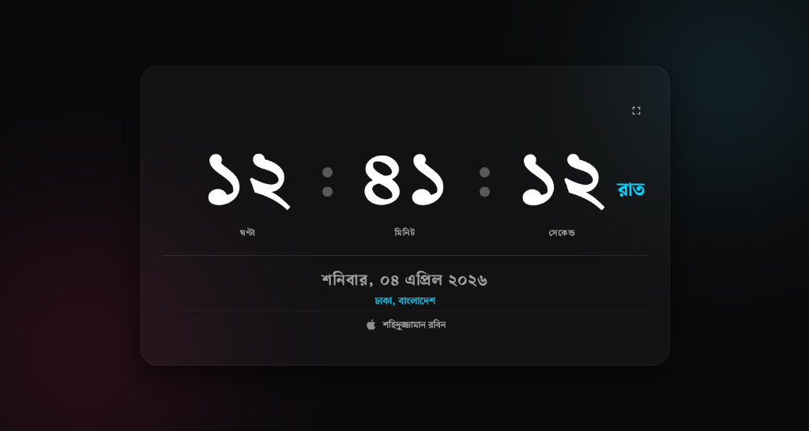

# 🕰️ Modern Bengali Digital Clock Screensaver

A premium, ambient, and high-performance digital clock screensaver featuring a sophisticated **Mechanical Vertical Slide** animation and elegant **Glassmorphic** aesthetics. Designed specifically for macOS deployment via `WebViewScreenSaver`.



## ✨ Core Features

- **Smooth Mechanical Scroll**: A custom animation where digits slide vertically when changing—imitating a luxury mechanical counter with precision and fluidity.
- **Dynamic 24-Hour Atmosphere**: A sophisticated `HTML5 Canvas` environment system that automatically transitions through **Night (Starry sky)**, **Dawn**, **Morning (Floating clouds)**, **Noon (Clear deep sky)**, **Late Afternoon (Amber sunset)**, and **Evening (Ambient rain)**.
- **Glassmorphism Design**: High-end translucent background with multi-layered blur, depth-shadows, and adaptive text contrast.
- **Real-Time Weather Integration**: Live temperature fetching based on your automatic IP-location, displayed with beautiful Bengali digits and symbols (e.g., ২৭°সে.).
- **Localized Date & Calendar**: Automatic calculation of the **Bengali Date (বঙ্গাব্দ)** (e.g., ২১ চৈত্র ১৪৩২) alongside the Gregorian date.
- **Adaptive Locality**: IP-based geolocation that translates your current district/city and country into perfect Bengali typography.
- **Zero-Touch Automation**: Fully automated theme-switching logic that perfectly captures the "mood" of the time of day without any manual input required.
- **Optimized for Screensavers**: Single-file standalone bundle with full-screen support and automatic cursor-hiding for an immersive experience.

## 🎨 Customization

### Changing the Signature Name
To change the credit name at the bottom of the clock:
1. Open `index.html` in a text editor.
2. Search for the text `শহিদুজ্জামান রবিন` (around line 67).
3. Replace it with your own name.
4. **Important**: After saving `index.html`, you **must** run the bundler to update the standalone file:
   ```bash
   python3 bundle_clock.py
   ```

## 🚀 How to Use as a Screensaver (macOS)

1. **Prerequisite**: Download and install [WebViewScreenSaver](https://github.com/liquidfeline/WebViewScreenSaver/releases).
2. **Download this Repository**: Clone or download this project to your local machine.
3. **Configure Screen Saver**:
   - Open **System Settings > Screen Saver**.
   - Select **WebViewScreenSaver** and click **Options**.
   - Click **Add URL** and enter the absolute file path to the standalone file:
     `file:///path/to/your/folder/BanglaClock-Standalone.html`
4. **Enjoy**: Your Mac will now display the clock natively during inactivity.

## 🛠️ Technical Details

- **Structure**: Semantic HTML5.
- **Styling**: Vanilla CSS with 3D Transforms and Custom Bezier curves.
- **Logic**: Vanilla JavaScript (ES6+).
- **Fonts**: Custom 'Shurjo' font embedded directly into the standalone HTML via Base64 for ultimate portability.
- **Standalone Builder**: Includes a `bundle_clock.py` script that automatically bundles the CSS, JS, and Fonts into a single `BanglaClock-Standalone.html` file.

## 🔧 Deployment / Updating

If you make changes to the CSS or JS files, run the bundler to update the standalone screensaver file:

```bash
python3 bundle_clock.py
```

---
*Created by Shahiduzzaman Robin*
